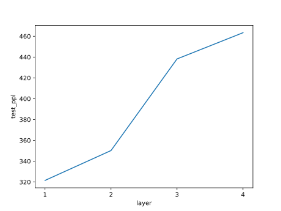

# Mini Language Model by LSTM

这是一个微型的语言模型，由PyTorch实现，并由LSTM进行建模，并可以**自定义模型深度**。


## 训练

训练可直接运行train.py文件，同时项目也提供了一些参数可供选择，示例代码如下所示：

```
python train.py --n_step 5 \
                --hidden_size 128 \
                --batch_size 128 \
                --learning_rate 0.0005 \
                --epochs 5 \
                --embed_size 256 \
                --epochs_save 5 \
                --data_dir data/dataset \
                --num_layers 1 \
                --ckpt_dir model/ckpt
```

## 正确性验证

项目将实现的LSTM模型与PyTorch库时间的模型输出进行比较，可以通过在命令行中输入以下命令运行并比较结果，如果想修改初始的参数或者输入维度，可以直接修改代码文件。

```
python model/lstm.py
```


## 结果

项目对比了实现的LSTM语言模型的运行结果，具体如下：



